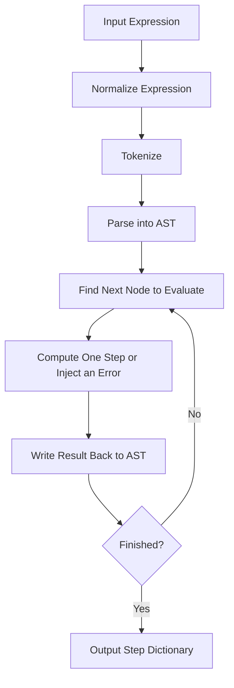
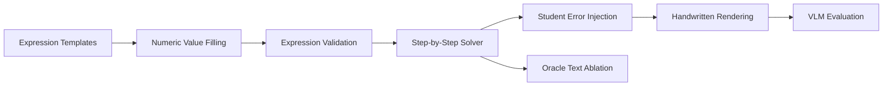

Equation10K: Teacher-Style Error Diagnosis in Handwritten Arithmetic Solutions
> A benchmark construction project for evaluating whether open-source and proprietary vision-language models can identify mistakes in students' handwritten arithmetic solutions in a teacher-like manner.
Overview
Equation10K is designed to evaluate a vision-language model's ability to determine whether each step in a student's arithmetic solution is correct.
The benchmark pipeline covers:
automatic arithmetic expression generation;
difficulty and problem-type control;
step-by-step solution generation;
probabilistic student-error injection;
handwritten rendering with multiple handwriting styles;
evaluation of both open-source and proprietary vision-language models;
text-only ablation experiments using oracle solution text.
---
1. Automatic Expression Generation
1.1 Generation Strategy
Expressions are generated with a three-stage pipeline:
Generate the structure
Fill in numeric values
Validate the final expression
The template layer defines only the operation structure and does not contain concrete numbers.  
The value layer fills templates with integers, decimals, fractions, or mixed numeric types according to the selected problem category.  
The validation layer converts the displayed expression into a Python-evaluable form and filters out invalid cases such as division by zero, syntax errors, or abnormal results.
Templates use the character `N` as a placeholder for a number.
For example:
```text
N + N × N
```
This template represents a three-number expression with addition and multiplication. Concrete values such as `8`, `2.5`, or `1/3` are inserted later.
Expressions Without Parentheses
For an expression containing `n` numbers, `n - 1` operators are required.
All operator sequences are generated automatically using the Cartesian product of:
```text
+  -  ×  ÷
```
This avoids manually writing templates and reduces the risk of missing particular operator combinations.
Expressions With Parentheses
Parenthesized structures are generated using binary expression trees:
each internal node represents an operator;
each leaf node represents `N`;
`tree_shapes(left, right)` recursively enumerates all possible left/right subtree partitions;
each tree is then converted back into an arithmetic expression.
This procedure effectively enumerates all valid binary association structures.
1.2 Structure Statistics
Number of Values	Structures Without Parentheses	Parenthesis Shapes	Structures With Parentheses	Total
3	16	2	32	48
4	64	5	320	384
5	256	14	3,584	3,840
Total	336	12	3,936	4,272
For expressions containing 3 to 5 numbers, the base structure library contains 4,272 automatically generated structures.
The number of structures grows rapidly when extending the generator to 6 or more numbers, while still requiring no manually added templates.
---
2. Difficulty Definition
In educational settings, arithmetic mistakes often come from confusion about rules such as:
evaluating operations from left to right;
applying multiplication and division before addition and subtraction;
evaluating parentheses first.
Equation10K therefore defines five difficulty levels based on operation complexity.
Difficulty	Main Characteristics	Example
1	Single operation type; straightforward order	`8 + 3 + 6`
2	Mixed operators with equal precedence; left-to-right evaluation	`18 - 7 + 5`, `48 ÷ 6 × 3`
3	Mixed multiplication/division and addition/subtraction	`8 + 6 × 4 - 3`
4	Single-level parentheses that change evaluation order	`8 × (6 - 4) + 3`
5	Nested parentheses and multiple interacting rules	`6 + 24 ÷ (8 - 4) × 3`, `5 × (12 - (8 - 3))`
---
3. Problem Types
Problem type and difficulty are treated as two independent dimensions:
Problem type determines which expression structures are allowed.
Difficulty determines which complexity level is sampled from those structures.
Equation10K defines 10 problem types.
Problem Type	Filtering Rule
Addition	Operator set must be exactly `{+}`
Subtraction	Operator set must be exactly `{-}`
Multiplication	Operator set must be exactly `{×}`
Division	Operator set must be exactly `{÷}`
Mixed Operations	Must contain at least two operator types and no parentheses
Parenthesized Operations	Template must contain parentheses
Fraction Arithmetic	Uses all structures available at the current difficulty; all values are fractions
Decimal Arithmetic	Uses all structures available at the current difficulty; all values are decimals
Exponentiation	Expression contains square or cube operations
Random Combination	Randomly combines the nine problem types above
---
4. Expression Conversion and Validation
Every generated expression is validated before being accepted.
The validation stage is used to filter out invalid expressions, including cases such as:
division by zero;
malformed syntax;
expressions that cannot be evaluated safely;
abnormal or unusable results.
---
5. Dataset Size
Each problem type is generated across difficulty levels 1–5.
Problem Type	Difficulty	Samples per Difficulty	Listed Total
Addition	1–5	1,000	5,000
Subtraction	1–5	1,000	5,000
Multiplication	1–5	1,000	5,000
Division	1–5	1,000	5,000
Mixed Operations	1–5	1,000	5,000
Parenthesized Operations	1–5	1,000	5,000
Fraction Arithmetic	1–5	1,000	5,000
Decimal Arithmetic	1–5	1,000	5,000
Exponentiation	1–5	1,000	5,000
Random Combination	1–5	1,000	50,000*
> **Note:** The original README lists `50,000` as the total for **Random Combination**, while `1,000 samples × 5 difficulty levels` would normally imply `5,000`. The original value is preserved here and should be verified.
---
6. Step-by-Step Solution Generation
The solution generator parses an arithmetic expression into a sequence of calculation steps.
It can also inject simulated student mistakes with configurable probability, producing training/evaluation data with correct/incorrect labels.
6.1 Processing Pipeline

6.2 Supported Error Types
Error Type	Description
`wrong_value`	Carelessly writes down an incorrect value
`wrong_operator`	Uses the wrong operation symbol
`wrong_order`	Applies parentheses or order of operations incorrectly
`calculation_error`	Makes an arithmetic calculation error
`propagated`	Propagates an earlier mistake into subsequent steps
6.3 Simulated Student Error Behavior
The generator models error propagation.
Once an incorrect step occurs, later steps are affected by the previous mistake. From that point onward, subsequent steps are labeled:
```json
{
  "correct": false
}
```
This reflects the common pattern in which one early arithmetic mistake causes all later steps to become incorrect.
---
7. Handwritten Solution Rendering
The generated step-by-step solutions are converted into handwritten-style images.
Handwriting Styles
The current implementation includes 12 handwriting styles.
---
8. Vision-Language Model Evaluation
The benchmark evaluates whether a vision-language model can correctly determine whether each handwritten arithmetic step is valid.
Both open-source and proprietary / API-based models are supported.
---
9. Running the Project
Step 1 — Generate Questions
```bash
python gen_questions.py
```
Step 2 — Generate Solution Steps
```bash
python gen_steps.py
```
Step 3 — Render Handwritten Solutions
```bash
python various_handwriting.py
```
Step 4 — Evaluate an Open-Source Vision-Language Model
Evaluate all files:
```bash
python benchmark_vlm_with_metrics.py --backend qwen-local --all
```
Evaluate a specific problem type:
```bash
python benchmark_vlm_with_metrics.py --backend qwen-local --type fraction
```
Step 5 — Evaluate a Proprietary / OpenAI-Compatible Vision-Language Model
Set the API configuration:
```bash
export OPENAI_API_KEY="your-key"
export OPENAI_BASE_URL="https://your-api-host/v1"
```
Evaluate all files:
```bash
python benchmark_vlm_with_metrics.py --backend openai-compatible --all
```
Evaluate a specific problem type:
```bash
python benchmark_vlm_with_metrics.py --backend openai-compatible --type fraction
```
---
10. Ablation Experiments
Oracle Text Input
Run the text-only benchmark with a local model:
```bash
python benchmark_text_with_metrics.py --type fraction \
    --backend qwen-vl-text-local \
    --model Qwen/Qwen2___5-VL-7B-Instruct
```
Run the text-only benchmark with an OpenAI-compatible backend:
```bash
python benchmark_text_with_metrics.py --file steps/fraction.json \
    --backend openai-compatible \
    --model gpt-5.6-sol \
    --api-key "$OPENAI_API_KEY"
```
---
11. Generated Dataset
The dataset generated for this experiment is available here:
Google Sheets:  
https://docs.google.com/spreadsheets/d/1LhPTykJGEQucwKXFUYcSizweWGgGYdIOeYbEcNJJbLw/edit?usp=drive_link
---
Project Pipeline at a Glance

